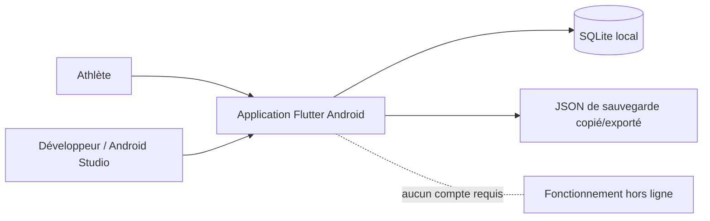

# Contexte et conteneurs

```mermaid
flowchart LR
  Athlete["Athlète"] --> Android["Application Flutter Android"]
  Android --> SQLite[("SQLite local")]
  Android --> File["JSON de sauvegarde copié/exporté"]
  Android -. "aucun compte requis" .- Offline["Fonctionnement hors ligne"]
  Dev["Développeur / Android Studio"] --> Android
```

`CURRENT` : aucune API distante n'est requise. Les références `.SOURCE/` et `reference/` restent hors produit et hors Git.
