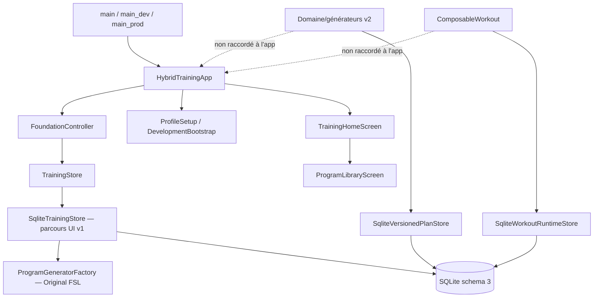

# Architecture actuelle

Source : code au `2080a27`, revu le 18 juillet 2026.

## CURRENT

La navigation est actuellement impérative (`MaterialPageRoute`). L'organisation feature-first existe, mais `TrainingHomeScreen` regroupe encore plusieurs destinations. Le schéma v2/v3 et ses stores sont testés isolément ; ils ne décrivent pas encore le parcours produit actif.

## TARGET

Présentation par feature, état injecté testable, navigation déclarative et raccordement du plan versionné/runtime composable, tout en conservant un adaptateur de lecture v1.
