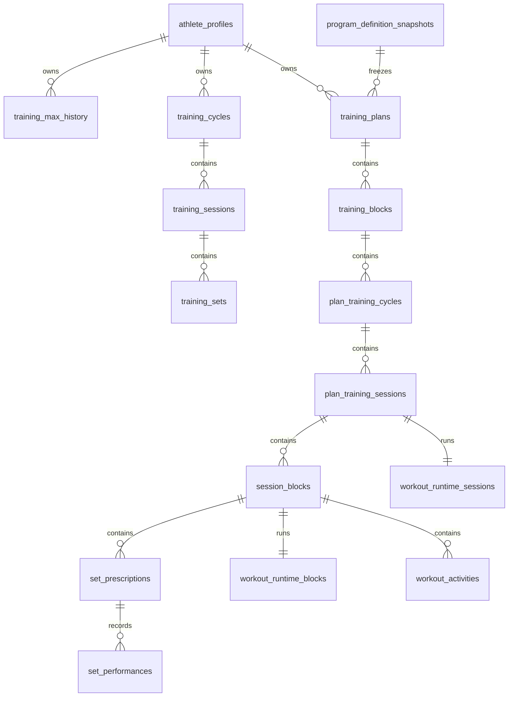

# Modèle de données et schéma logique

Source : `lib/core/database/database_schema.dart`, `DatabaseSchema.version = 3`.

## Tables CURRENT

| Version | Table | Clé et colonnes principales | Relations / invariants |
|---|---|---|---|
| v1 | `athlete_profiles` | PK `id`; `display_name`, `preferred_unit`, `rounding_increment`, dates | unité `kg/lb`; suppression logique |
| v1 | `exercises` | PK `id`; `name_key`, `category`, `is_main_lift` | ID stable non traduit |
| v1 | `training_max_history` | PK `id`; `athlete_id`, `exercise_id`, charges, unité, date | FK athlète/exercice |
| v1 | `gyms` | PK `id`; `athlete_id`, `name`, `is_default` | FK athlète |
| v1 | `gym_bars` | PK `id`; `gym_id`, `name`, `weight`, `unit`, `quantity` | FK gym |
| v1 | `gym_plates` | PK `id`; `gym_id`, `weight`, `unit`, `quantity` | FK gym |
| v1 | `program_definitions` | PK `id`; `schema_version`, `name_key`, `definition_json` | snapshot JSON historique |
| v1 | `training_cycles` | PK `id`; FKs athlète/programme; version, début, statut, réglages JSON | cycle v1 |
| v1 | `training_sessions` | PK `id`; FK cycle; date, début/fin, statut, notes | reprise v1 |
| v1 | `training_sets` | PK `id`; FK séance; lift, séquence, prescription et résultat | séquence stable |
| v1 | `personal_records` | PK `id`; lift, charge, répétitions, unité, source | source set nullable |
| v1 | `app_metadata` | PK `key`; `value` | métadonnées locales |
| v2 | `program_definition_snapshots` | PK `id`; blueprint/version, JSON, provenance, date | immuable par version |
| v2 | `training_plans` | PK `id`; FKs athlète/snapshot; blueprint/version, macrocycle, statut | plan versionné |
| v2 | `training_blocks` | PK `id`; FK plan; séquence, rôle, template, statut | unique plan/séquence |
| v2 | `plan_training_cycles` | PK `id`; FK bloc; séquence, date, statut | unique bloc/séquence |
| v2 | `plan_training_sessions` | PK `id`; FK cycle; séquence, date, statut, notes, repos | unique cycle/séquence |
| v2 | `session_blocks` | PK `id`; FK séance; séquence, kind, mouvement, provenance | unique séance/séquence |
| v2 | `set_prescriptions` | PK `id`; FK bloc; séquence, charges, JSON, provenance | unique bloc/séquence |
| v2 | `set_performances` | PK `id`; FK prescription; résultat, reps, charge, note, date | historique de résultat |
| v2 | `plan_events` | PK `id`; FK plan; séquence/type, transitions, TM JSON, provenance | unique plan/séquence |
| v3 | `workout_runtime_sessions` | PK/FK `session_id`; statut, bloc actif, notes, dates | une exécution par séance |
| v3 | `workout_runtime_blocks` | PK/FK `session_block_id`; statut, `rest_until`, date | cascade avec bloc |
| v3 | `workout_activities` | PK `id`; FK bloc; séquence, label, cible/résultat JSON, statut | unique bloc/séquence; index bloc/séquence |

Toutes les migrations s'exécutent dans la transaction d'ouverture. La sauvegarde v3 exporte ces 24 tables ; l'import supprime les enfants avant les parents, réinsère les parents avant les enfants et rollback intégralement à la première erreur.
