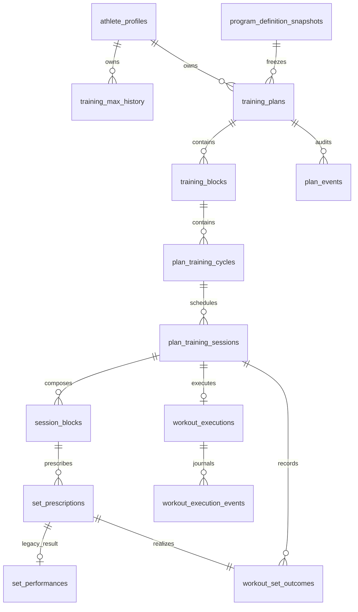

# Modèle de données et schéma logique

Source : `lib/core/database/database_schema.dart`, schéma SQLite v4.

## Évolution

- v1 : profil, équipement, définitions historiques, cycles/séances/séries et PR.
- v2 : plans versionnés, snapshots immuables, blocs/cycles/séances structurés,
  prescriptions, performances et événements de plan.
- v3 : ancien runtime composable par blocs, conservé pour compatibilité.
- v4 : machine d’état canonique, résultats réels ordonnés et journal d’actions.

v3 ne suffisait pas pour distinguer `activeSet`, `resting` et `paused`, conserver
une pile d’annulation, saisir RPE/charge/répétitions réelles par prescription et
journaliser chaque action sans reconstruire l’état depuis du JSON libre.

Les migrations v1→v4, v2→v4 et v3→v4 sont testées avec réouverture et
conservation des lignes. La sauvegarde v4 exporte aussi `import_runs` et les trois
tables v4 ; les sauvegardes v1/v2/v3 sont normalisées avec des tables nouvelles
vides avant l’application atomique.
