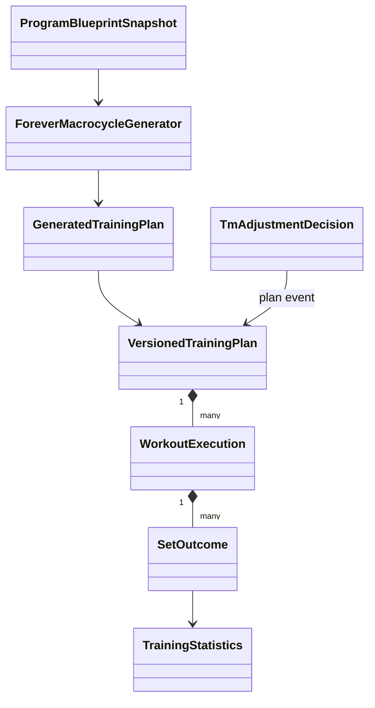

# Modèle de domaine

Les snapshots et décisions portent identifiants stables, versions et provenance.
Les classes du domaine sont en Dart pur ; contrôleurs Flutter et dépôts SQLite
restent dans les couches présentation et données.
