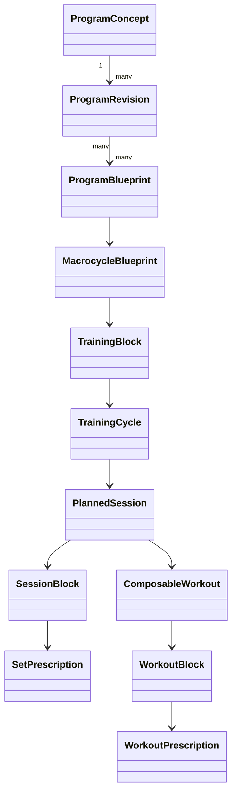

# Modèle de domaine

`CURRENT` : ces concepts Dart purs existent et sont testés. `POC_TARGET` : leur raccordement au contrôleur et aux écrans. Les IDs persistants sont en anglais stable et indépendants des libellés.
