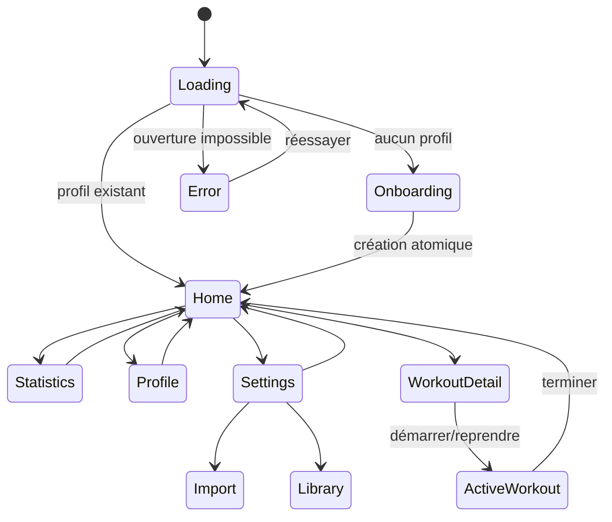

# États de navigation

```mermaid
stateDiagram-v2
  [*] --> Loading
  Loading --> Onboarding: aucun profil
  Loading --> Home: profil existant
  Loading --> Error: ouverture impossible
  Error --> Loading: réessayer
  Onboarding --> Home: création atomique
  Home --> Statistics
  Home --> Profile
  Home --> Settings
  Home --> WorkoutDetail
  WorkoutDetail --> ActiveWorkout: démarrer/reprendre
  ActiveWorkout --> Home: terminer
  Statistics --> Home
  Profile --> Home
  Settings --> Home
  Settings --> Import
  Settings --> Library
```

`CURRENT` : les cinq commandes basses restent visibles et doivent permettre de changer de destination sans empiler des routes inutiles.
