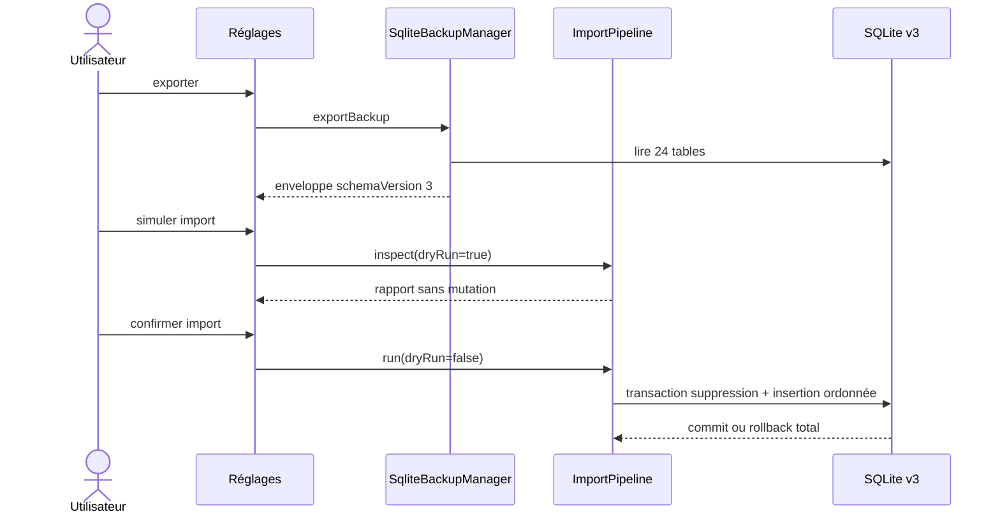

# Séquence — sauvegarde et import

```mermaid
sequenceDiagram
  actor U as Utilisateur
  participant UI as Réglages
  participant M as SqliteBackupManager
  participant P as ImportPipeline
  participant DB as SQLite v3
  U->>UI: exporter
  UI->>M: exportBackup
  M->>DB: lire 24 tables
  M-->>UI: enveloppe schemaVersion 3
  U->>UI: simuler import
  UI->>P: inspect(dryRun=true)
  P-->>UI: rapport sans mutation
  U->>UI: confirmer import
  UI->>P: run(dryRun=false)
  P->>DB: transaction suppression + insertion ordonnée
  DB-->>P: commit ou rollback total
```

Les sauvegardes v1 et v2 sont acceptées ; les tables absentes des versions anciennes sont initialisées vides.
