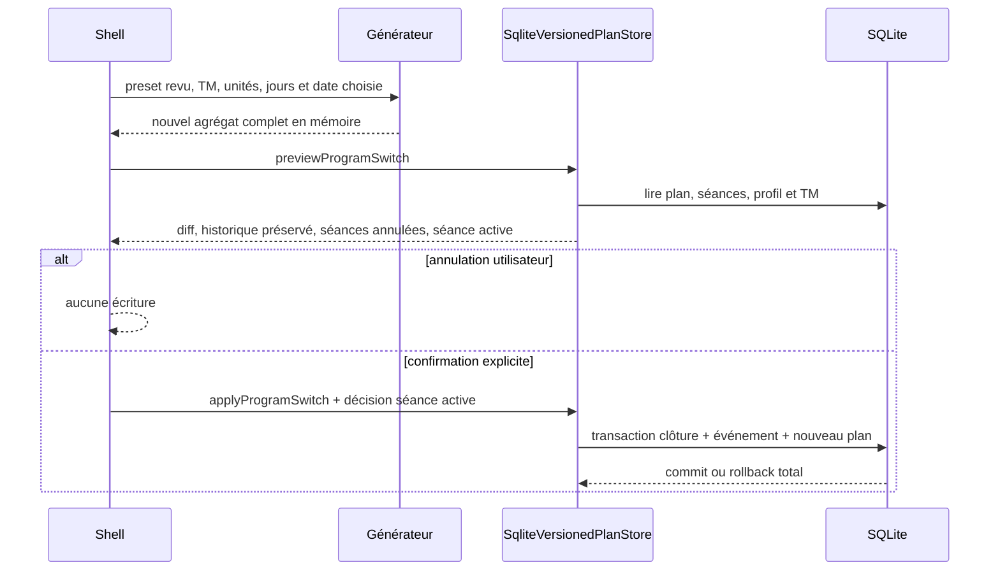

# Séquence — changer de programme

```mermaid
sequenceDiagram
  participant UI as Shell
  participant G as Générateur
  participant S as SqliteVersionedPlanStore
  participant DB as SQLite
  UI->>G: preset revu, TM, unités, jours et date choisie
  G-->>UI: nouvel agrégat complet en mémoire
  UI->>S: previewProgramSwitch
  S->>DB: lire plan, séances, profil et TM
  S-->>UI: diff, historique préservé, séances annulées, séance active
  alt annulation utilisateur
    UI-->>UI: aucune écriture
  else confirmation explicite
    UI->>S: applyProgramSwitch + décision séance active
    S->>DB: transaction clôture + événement + nouveau plan
    DB-->>S: commit ou rollback total
  end
```
