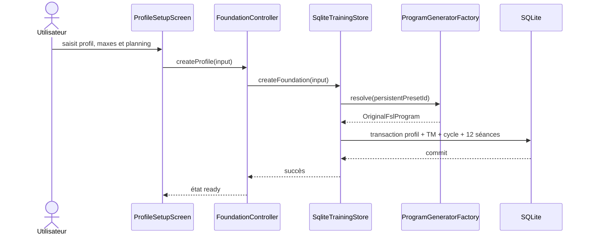

# Séquence — création du plan de compatibilité

```mermaid
sequenceDiagram
  actor U as Utilisateur
  participant UI as ProfileSetupScreen
  participant C as FoundationController
  participant S as SqliteTrainingStore
  participant G as ProgramGeneratorFactory
  participant DB as SQLite
  U->>UI: saisit profil, maxes et planning
  UI->>C: createProfile(input)
  C->>S: createFoundation(input)
  S->>G: resolve(persistentPresetId)
  G-->>S: OriginalFslProgram
  S->>DB: transaction profil + TM + cycle + 12 séances
  DB-->>S: commit
  S-->>C: succès
  C-->>UI: état ready
```

Beginner Prep School suit une voie v2 testée mais n'est pas encore raccordé à cette séquence.
