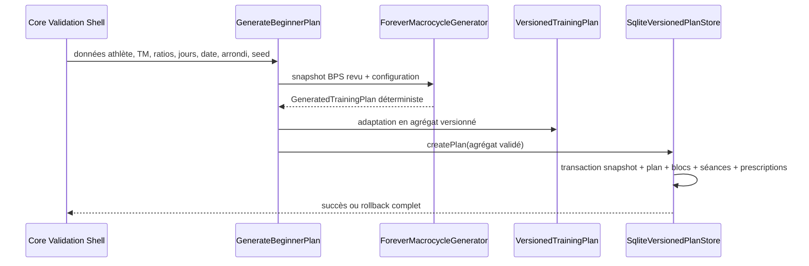

# Séquence — génération d’un plan

```mermaid
sequenceDiagram
  participant UI as Core Validation Shell
  participant UC as GenerateBeginnerPlan
  participant G as ForeverMacrocycleGenerator
  participant P as VersionedTrainingPlan
  participant DB as SqliteVersionedPlanStore
  UI->>UC: données athlète, TM, ratios, jours, date, arrondi, seed
  UC->>G: snapshot BPS revu + configuration
  G-->>UC: GeneratedTrainingPlan déterministe
  UC->>P: adaptation en agrégat versionné
  UC->>DB: createPlan(agrégat validé)
  DB->>DB: transaction snapshot + plan + blocs + séances + prescriptions
  DB-->>UI: succès ou rollback complet
```
