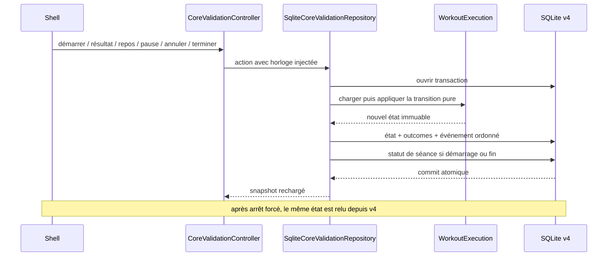

# Séquence — exécuter et reprendre une séance

```mermaid
sequenceDiagram
  participant UI as Shell
  participant C as CoreValidationController
  participant R as SqliteCoreValidationRepository
  participant D as WorkoutExecution
  participant DB as SQLite v4
  UI->>C: démarrer / résultat / repos / pause / annuler / terminer
  C->>R: action avec horloge injectée
  R->>DB: ouvrir transaction
  R->>D: charger puis appliquer la transition pure
  D-->>R: nouvel état immuable
  R->>DB: état + outcomes + événement ordonné
  R->>DB: statut de séance si démarrage ou fin
  DB-->>R: commit atomique
  R-->>C: snapshot rechargé
  Note over UI,DB: après arrêt forcé, le même état est relu depuis v4
```
