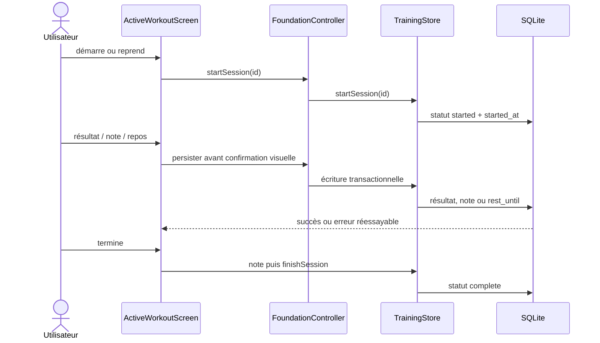

# Séquence — séance et reprise

```mermaid
sequenceDiagram
  actor U as Utilisateur
  participant UI as ActiveWorkoutScreen
  participant C as FoundationController
  participant S as TrainingStore
  participant DB as SQLite
  U->>UI: démarre ou reprend
  UI->>C: startSession(id)
  C->>S: startSession(id)
  S->>DB: statut started + started_at
  U->>UI: résultat / note / repos
  UI->>C: persister avant confirmation visuelle
  C->>S: écriture transactionnelle
  S->>DB: résultat, note ou rest_until
  DB-->>UI: succès ou erreur réessayable
  U->>UI: termine
  UI->>S: note puis finishSession
  S->>DB: statut complete
```
