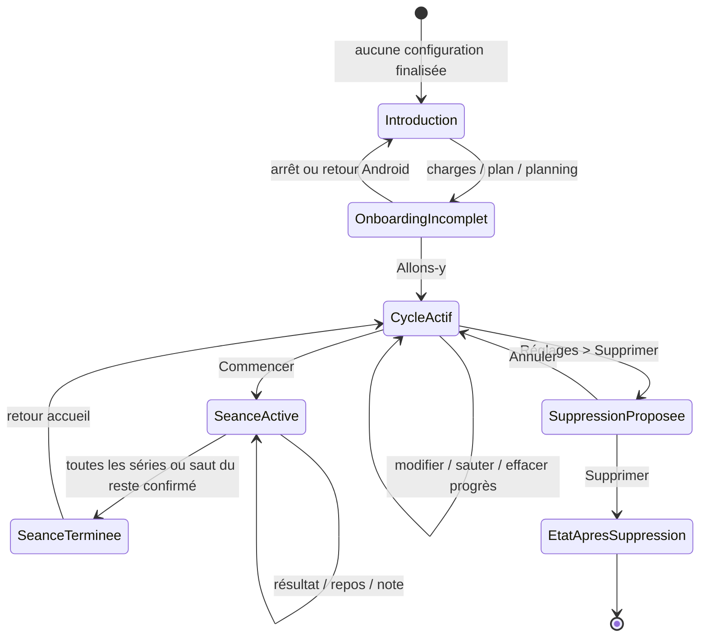

# Cycle de vie des données dans l’application d’origine

Ce document décrit les transitions visibles de l’application Android d’origine.
Il ne décrit ni son schéma interne ni une règle cible pour la reconstruction.

La dernière transition est `BLOCKED_SAFETY` : son écran cible n’a pas été observé.

## Création du profil

`NOT_FOUND_AFTER_SYSTEMATIC_SEARCH` comme objet utilisateur distinct. L’application
ne demande ni nom, ni e-mail, ni compte. Le premier état métier visible est la saisie
des quatre exercices. L’expression « création du profil » doit donc être évitée pour
décrire l’application d’origine.

L’onboarding incomplet est volatil : fermer ou quitter avant « Allons-y » ramène à
l’introduction et perd les charges, unité, plan, date et fréquence saisis.

## Création du cycle

La création visible résulte de la chaîne suivante :

1. quatre charges et leur nature 1–10 rep max ;
2. choix d’un plan dans un catalogue de treize entrées ;
3. date de début ;
4. fréquence compatible avec le plan ;
5. affectation des mouvements aux jours ;
6. écran « Tout est prêt ! » ;
7. « Allons-y ».

Après cette dernière action, l’accueil affiche les séances datées, le tableau des
semaines 5+/3+/1+ et les statistiques. Le cycle et ses réglages survivent à un arrêt
forcé. Statut : `OBSERVED`.

## Modification du cycle

Chemins observés :

- Accueil → Cycle en cours → Modifier ;
- Détail de séance → trois points → Modifier le cycle.

L’éditeur expose les quatre charges sous trois vues (Max 1 Rép., Charge Ent., Série
1+), le plan, les séries Joker, l’option First Set Last et l’assistance. Une icône
disquette suggère une sauvegarde explicite. Le retour Android depuis le menu du plan
a fermé l’éditeur sans modification visible.

La sauvegarde d’une modification réelle, son impact sur les séances terminées et la
régénération éventuelle du cycle sont `OBSERVED_PARTIALLY` : aucune valeur du cycle
actif n’a été écrasée pendant ce lot.

Les réglages de progression, de plaques/barres et d’unité sont distincts de cet
éditeur, mais ils recalculent visiblement des valeurs futures. La réorganisation des
ensembles de plaques a modifié l’arrondi des séances, puis l’ordre initial a été
rétabli.

## Séance active

Une séance devient active après « Commencer ». Si elle est planifiée un autre jour,
un dialogue propose de démarrer sans déplacement ou de changer la date.

État actif visible :

- horodatage global ;
- série courante et nombre de séries restantes ;
- plaques et barre ;
- résultat succès/échec/saut ;
- répétitions réalisées pour échec et AMRAP ;
- repos ;
- notes ;
- ensemble de plaques et barre choisis pour la note/série.

Les résultats et les notes sont enregistrés au fil de l’eau. Après arrêt forcé,
l’accueil affiche « EN COURS » et la séance se rouvre au bon endroit. Le temps de
repos après une interruption n’a pas été retenu comme preuve de durée exacte, car un
essai a été perturbé par une intervention concurrente. Statut général : `OBSERVED` ;
minuteur après arrière-plan : `OBSERVED_PARTIALLY`.

## Séance terminée

Deux chemins ont été observés : compléter les séries restantes ou confirmer
« Sauter les séries » depuis la croix rouge. Le second laisse les blocs non réalisés
non cochés, mais la séance reçoit tout de même le badge « COMPLÉTÉ ».

Le détail terminé conserve :

- répétitions prescrites et réalisées, dont `7/5+` ;
- succès, échec et saut ;
- note attachée à une série ;
- résultat AMRAP à 0 ;
- assistance non réalisée ;
- date et mouvement.

Le menu permet d’effacer le progrès, changer la date, modifier les résultats ou le
cycle. Les badges et détails persistent après arrêt forcé. Statut : `OBSERVED`.

## Arrêt du cycle

Les libellés Arrêter le cycle, Abandonner le cycle, Terminer le cycle, Recommencer ou
Nouveau cycle sont `NOT_FOUND_AFTER_SYSTEMATIC_SEARCH` dans l’accueil, les menus de
séance, l’éditeur et les réglages.

La fonction « Supprimer » des réglages parle de « tous vos cycles » ; elle ne doit
pas être assimilée sans preuve à un simple arrêt ou archivage du cycle courant.

## Changement de programme

Le plan peut être ouvert dans l’éditeur de cycle, qui liste les treize plans. La
sélection d’un autre plan sur un cycle contenant des résultats n’a pas été exécutée.
Les effets sur historique, séances futures, Training Max et assistance sont donc
`UNKNOWN`.

## Export

Chemin : Réglages → Données → Exporter.

L’application ouvre le partage Android avec le nom proposé `fiveThreeOne.json`.
Retour Android annule sans modifier les données. Un partage vers Termux a annoncé
un enregistrement réussi dans l’espace privé de cette application.

Le fichier n’a pas pu être copié vers le dossier de preuves sans contourner la
sandbox Android. Format interne, schéma, catégories de données, taille exacte et
réimport sont `BLOCKED_TECHNICAL`. Le partage vers un PC était `BLOCKED_NETWORK`.

## Import

Chemin : Réglages → Données → Importer.

Le sélecteur Android affiche les JSON et filtre le fichier synthétique `.txt`. Les
scénarios suivants sont `OBSERVED` :

- annulation par Retour Android, données conservées ;
- JSON manifestement invalide, retour silencieux aux réglages ;
- JSON vide, retour silencieux aux réglages ;
- mauvaise extension absente de la liste de fichiers compatibles.

Aucun aperçu, rapport, choix fusion/remplacement ni message d’erreur n’a été visible.
L’import du véritable export, le double import, l’import après effacement et
l’atomicité sont `BLOCKED_TECHNICAL` ou `BLOCKED_SAFETY` selon qu’ils dépendent du
fichier inaccessible ou d’une suppression réelle.

## Réinitialisation

Les fonctions suivantes sont `NOT_FOUND_AFTER_SYSTEMATIC_SEARCH` :

- refaire seulement l’introduction ;
- relancer l’onboarding ;
- réinitialiser le profil ;
- réinitialiser les réglages ;
- supprimer seulement l’historique.

L’onboarding incomplet se réinitialise néanmoins de fait lors d’une fermeture, sans
dialogue ni option explicite.

## Effacement total

Chemin : Réglages → Données → Supprimer.

Le dialogue observé affiche :

- « Supprimer tous vos cycles? » ;
- « Êtes-vous sûr de supprimer les données de tous vos cycle? Cette opération est
  irréversible. » ;
- Annuler ;
- Supprimer.

Annuler préserve les cycles et résultats après redémarrage (`OBSERVED`). Confirmer
n’a pas été autorisé sur le téléphone physique (`BLOCKED_SAFETY`). Le sort des
réglages, plaques, barres, achats, unité et premier jour reste donc `UNKNOWN`.

## Matrice de conservation observée

| Donnée | Onboarding abandonné | Redémarrage après cycle | Séance active redémarrée | Annulation suppression | Suppression confirmée |
|---|---|---|---|---|---|
| Charges onboarding | Perdues | Sans objet | Sans objet | Sans objet | `UNKNOWN` |
| Cycle | Non créé | Conservé | Conservé | Conservé | `BLOCKED_SAFETY` |
| Série validée | Sans objet | Conservée | Conservée | Conservée | `BLOCKED_SAFETY` |
| Notes | Sans objet | Conservées | Conservées | Conservées | `BLOCKED_SAFETY` |
| Réglages repos | Sans objet | Conservés | Conservés | Conservés | `UNKNOWN` |
| Unité / premier jour | Sans objet | Conservés | Conservés | Conservés | `UNKNOWN` |
| Plaques / barres fictives | Sans objet | Conservées | Conservées | Conservées | `UNKNOWN` |
| Achats intégrés | Disponibles | Disponibles | Disponibles | Disponibles | `UNKNOWN` |
