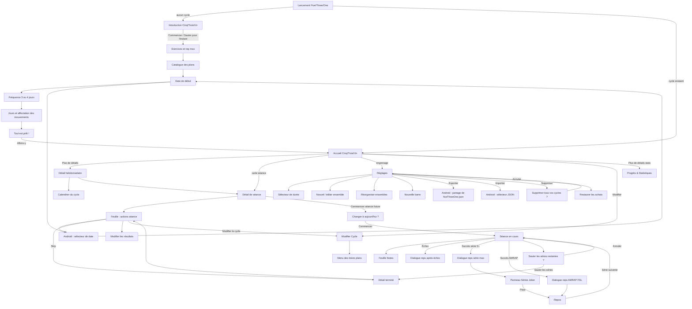

# Carte de navigation de l’application d’origine

La carte représente uniquement les destinations observées. Les surfaces Android
système sont séparées des écrans de l’application.

## Règles de retour observées

| Depuis | Retour interne / Android | Destination ou effet |
|---|---|---|
| Introduction | Retour Android | Lanceur Android |
| Onboarding incomplet | Retour Android puis relance | Introduction, valeurs perdues |
| Sélecteur de date | Retour ou toucher hors zone | Écran appelant, valeur inchangée |
| Détail hebdomadaire | Flèche interne | Accueil |
| Calendrier du cycle | Retour | Détail hebdomadaire |
| Séance active | Flèche interne / relance | Accueil avec séance EN COURS, reprise possible |
| Feuille Notes | Retour | Séance active, note conservée |
| Dialogue de fin anticipée | Annuler | Séance active intacte |
| Éditeur de résultats | Retour | Détail terminé sans changement |
| Réglages | Croix / retour | Accueil |
| Sélecteur d’import | Retour Android | Réglages, données conservées |
| Sharesheet export | Retour Android | Réglages, aucun export choisi |
| Statistiques détaillées | Retour Android lors du test | Sortie de l’application |

## Destinations non reliées car non trouvées

Profil, compte, bibliothèque autonome, fiche de programme, historique autonome,
records, notifications détaillées, RPE, aide, licences, refaire l’introduction,
arrêter le cycle et nouveau cycle manuel sont
`NOT_FOUND_AFTER_SYSTEMATIC_SEARCH`.
